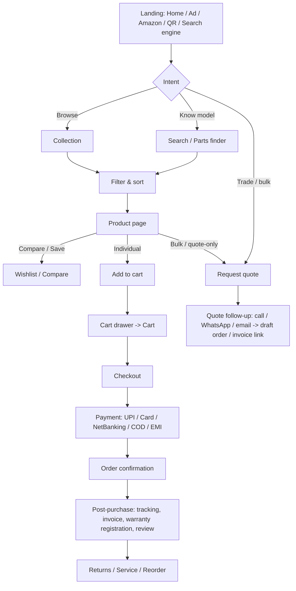

# Jeemex — Shopify Store Design System

> **How to use this file.** This document is the single source of truth for building the new Jeemex Shopify theme. Section 1–4 explain intent; sections 5–7 define tokens and components; section 8 maps the store to Shopify templates/sections; **section 9 is the complete set of e-commerce user flows** the theme must support; sections 10–13 cover data model, theme architecture, quality bars and open questions. Every colour, size and space must be referenced by token (`{colors.primary}`, `{spacing.md}`) — never hard-coded. In the theme, tokens are emitted as CSS custom properties (see §11.2).

---

## 1. Overview

### 1.1 Brand & store context

Jeemex is an Ahmedabad (Gujarat, India) sewing-machine brand. It positions itself as a large manufacturer building machines with Japanese-derived technology, and sells to two audiences at once:

1. **Trade buyers** — garment units, tailors' workshops, boutique factories, dealers and stockists who buy industrial machines, parts and accessories, often in multiples, often after a quote or a call.
2. **Individual buyers** — home tailors, small boutique owners and students who buy a single machine or accessory online and expect normal D2C checkout (UPI, COD, EMI, tracked delivery).

The current site (Wix) is a brochure: it lists product families but has no cart, no prices, no filters, no spec data, no search, no accounts and a copyright of 2020. The new store must turn that catalogue into a **trustworthy, spec-first, purchase-capable** storefront without losing the brand's industrial confidence.

**Known facts to reuse (from jeemex.in):**

| Item | Value |
|---|---|
| Tagline / hero line | "Express your dreamed design in your creative work" |
| Positioning line | Asia's largest sewing machine manufacturer; Japanese-technology machines *(claim to be re-verified by the client before launch)* |
| Values block | "Sustainability & Performance" — quality, smooth performance, long-term client trust |
| Office / contact | Raj Laxmi Complex, Gheekanta Rd, Old City, Gheekanta, Bhadra, Ahmedabad, Gujarat 380001, India |
| Channels | Instagram `@jeemex07`, Amazon India (search: jeemex), downloadable brochure PDF |
| Existing product families | See §8.2 |
| Existing custom work | A "Brand Legacy" page + Brand Information block already exist as custom Liquid sections and must be carried into the new theme (`page.brand-legacy`) |

### 1.2 Design intent (adapted from the Ferrari reference)

The Ferrari file's DNA is kept where it serves a machinery brand:

- **Sharp geometry** (0px radius) on every button, card, input group and band → reads as *precision engineering*, which is exactly the Jeemex promise.
- **Near-black canvas (#181818), never pure black**, for storytelling bands.
- **One scarce accent** — here Jeemex Vermilion — never spread across decorative elements.
- **Uppercase, tracked CTA and nav labels** (1.4px / 0.65px).
- **Display weight stays at 500**; photography and product imagery carry the drama.
- **Named 8px spacing ladder** (`xxxs`→`super`).
- **Hairlines, not shadow tiers**, for structure.

Where the reference is deliberately **changed** for e-commerce:

| Ferrari reference | Jeemex adaptation | Why |
|---|---|---|
| Dark canvas is the default on nearly every page | Dark = homepage hero, brand pages, footer. **Light = collections, PDP, cart, account, checkout, policies.** | Machine photography is shot on white/grey; price, spec and form legibility is better on light; long transactional sessions are easier on light. |
| Hero photo is the page chrome | Hero is used on Home, collection landing banners and Brand pages only. PDP leads with the product gallery. | Product first, mood second. |
| Hover states "never documented" | **All interaction states are specified** (hover, focus, active, disabled, loading, error). | A theme cannot ship without them. |
| Text-only buttons everywhere | Adds icon buttons, quantity steppers, chips, swatches, drawers, toasts | Commerce needs them. |
| Semantic colours minimal | Full success / warning / error / info set with soft backgrounds | Stock, validation, shipping messaging. |
| Yellow reserved for sub-brand | `#f6e500` reused **only as the focus ring on dark surfaces** (as in the reference); focus ring on light is `#181818` | Accessibility. |

### 1.3 Key characteristics

- Single accent: `{colors.primary}` (Jeemex Vermilion `#d63a0f`) for primary purchase CTAs, sale badges, active nav marker and the announcement bar.
- Dark storytelling bands + light transactional bands, alternating with intent — never random striping.
- Single sans family (Inter) across all roles; tabular numerals for prices and specs.
- Product imagery on `{colors.surface-product}` (#f4f4f2) plates so white-background machine photos sit on a consistent tone.
- Specs are a first-class visual element (spec cells, spec tables, comparison), not an afterthought in a tab.
- Trade-friendly: "Request a quote", bulk pricing tiers, GST invoice capture and dealer locator are core UI, not add-ons.
- Mobile-first for India: assume mid-range Android on 4G; lightweight JS, image-heavy pages must lazy-load; WhatsApp is a primary support channel.

---

## 2. Audit of the current site → requirements

| # | Observation on jeemex.in (Wix) | Requirement for new theme |
|---|---|---|
| 1 | No prices, cart or checkout; "Product" page is a list of category links | Full Shopify commerce: PDP, cart, checkout, accounts |
| 2 | Category names contain typos/unclear wording (e.g. "Belte Machine", "Barteck Machine", "Tremiier Machine", "Cutterlooks machine", "Umrala Machine", "Steem press", "Feed of the arm") | Normalise into clean collection titles (§8.2) — **client to confirm every rename** |
| 3 | Category pages are named `/copy-of-…` (duplicated Wix pages) | Clean handles `/collections/<slug>` with 301 redirects from every legacy URL |
| 4 | No spec data, no filters, no search | Metafield-driven specs, faceted filters (Shopify Search & Discovery), predictive search |
| 5 | Hero slider with 12 slides and no captions; "Our Best Sellers" with untitled images | Single purposeful hero; best-sellers as real product cards with price and CTA |
| 6 | Newsletter form only; no contact channel besides an address | Contact form, WhatsApp, call, quote form, dealer locator |
| 7 | Footer "© 2020 … all terms and condition managed by jeemex" — no real policy pages | Shipping, returns/warranty, privacy (DPDP-aligned), terms, refund policy pages |
| 8 | Brochure PDF only in header | Brochures/manuals as per-product downloads (metafield files) + global catalogue download |
| 9 | Amazon link in header | Keep as secondary "Also on Amazon" link; primary purchase path is the store |

---

## 3. Design principles

1. **Spec before sparkle.** A buyer of a machine must see model, type, speed, stitch, motor and price above the fold on mobile.
2. **Two buyers, one path.** Every product page serves both "Add to cart" (individual) and "Request bulk quote" (trade) without forcing a choice.
3. **Precision, not decoration.** Sharp corners, hairlines, disciplined type. No gradients on commerce surfaces; gradients allowed only on hero overlays.
4. **Red means act.** Vermilion appears on the one primary action per view (plus sale/urgency). If two vermilion elements compete, one is wrong.
5. **Never a dead end.** Every empty, error, out-of-stock and no-result state offers a next step (quote, WhatsApp, notify me, related products).
6. **Trust is a feature.** Warranty, GST invoice, secure payment, service network, delivery estimate and returns terms are visible at decision points (PDP buy box, cart, checkout).
7. **Fast on 4G.** Performance is a design constraint (§12.1).
8. **Accessible by default.** WCAG 2.2 AA minimum (§12.2).

---

## 4. Colors

### 4.1 Brand & accent

- **Jeemex Vermilion** (`{colors.primary}` — `#d63a0f`): primary CTA fill, sale badge, active-nav underline, announcement bar, price on sale, cart count badge. White text on it passes AA (4.7:1). **Placeholder pending client logo:** if the Jeemex logo uses a different brand colour, swap `primary`, `primary-hover`, `primary-active`, `primary-soft` only — the rest of the system is neutral. Any replacement must keep ≥4.5:1 contrast against white.
- **Hover** (`{colors.primary-hover}` — `#a02b0a`), **Active/pressed** (`{colors.primary-active}` — `#b3300c`), **Soft tint** (`{colors.primary-soft}` — `#fdece6`) for selected-state backgrounds and inline highlights.

### 4.2 Surfaces

| Token | Hex | Use |
|---|---|---|
| `{colors.canvas}` | `#181818` | Dark bands, header on dark pages, footer, toasts |
| `{colors.canvas-elevated}` | `#262626` | Cards on dark, newsletter band |
| `{colors.canvas-light}` | `#ffffff` | Default page background for commerce |
| `{colors.surface-soft-light}` | `#f7f7f7` | Alternating light bands, quote-form card, pincode checker |
| `{colors.surface-strong-light}` | `#ebebeb` | Dividers, disabled fills, out-of-stock badge |
| `{colors.surface-product}` | `#f4f4f2` | Product image plate (all product media containers) |

### 4.3 Text

| Token | Hex | Use |
|---|---|---|
| `{colors.ink}` | `#ffffff` | Display and body on dark |
| `{colors.body}` | `#a8a8a8` | Running text on dark |
| `{colors.body-on-light}` | `#181818` | Default text on light |
| `{colors.body-muted-on-light}` | `#5c5c5c` | Secondary text on light (≥7:1) |
| `{colors.muted}` | `#8a8a8a` | Captions on dark |
| `{colors.disabled}` | `#b5b5b5` | Disabled text (decorative; not relied upon for meaning) |

### 4.4 Lines

`{colors.hairline}` `#303030` (dark) · `{colors.hairline-on-light}` `#d2d2d2` · `{colors.hairline-soft}` `#ebebeb`.

### 4.5 Semantic

| Purpose | Foreground | Soft background | Used for |
|---|---|---|---|
| Success | `#03904a` | `#e6f5ee` | In stock, order confirmed, coupon applied, pincode serviceable |
| Warning | `#b45309` | `#fdf1e3` | Low stock, long-lead item, freight surcharge notice |
| Error | `#c62828` | `#fbe9e9` | Validation errors, payment failure, unserviceable pincode |
| Info | `#2b6f8f` | `#e5f1f6` | Shipping/GST notes, quote-only notices |

Focus ring: `{colors.focus-ring}` (#f6e500) on dark, `{colors.focus-ring-on-light}` (#181818) on light — 2px outline, 2px offset, **never removed**.

### 4.6 Scarcity rules

- Maximum **one** `button-primary` in the viewport per decision (e.g. PDP buy box **or** sticky bar, not both visible simultaneously).
- The livery band (full-width vermilion strip) appears **at most once per page**.
- Do not introduce any other saturated hue. Category colour-coding is done with icons and labels, not colour.

---

## 5. Typography

### 5.1 Family

**Inter** (variable, weights 400–700), self-hosted via `assets/` or Shopify font library; fallback `-apple-system, system-ui, sans-serif`. Use `font-display: swap`, preload the 400 and 500 WOFF2 subsets (Latin). For Hindi (Devanagari) and Gujarati locales fall back to **Noto Sans Devanagari** / **Noto Sans Gujarati** (declare via `unicode-range` so they only load when needed). Enable `font-variant-numeric: tabular-nums` on all prices, quantities, specs and tables.

### 5.2 Hierarchy

| Token | Size | Weight | Line-height | Tracking | Use |
|---|---|---|---|---|---|
| `display-mega` | 80px | 500 | 1.05 | -1.6px | Homepage hero H1 only |
| `display-xl` | 56px | 500 | 1.1 | -1.12px | Collection/brand hero, page titles |
| `display-lg` | 36px | 500 | 1.2 | -0.36px | Section headings, livery band |
| `display-md` | 26px | 500 | 1.35 | 0 | Sub-section heads, PDP title (desktop) |
| `title-md` | 18px | 600 | 1.3 | 0 | Card titles, drawer titles |
| `title-sm` | 16px | 500 | 1.4 | 0.08px | List labels, accordion headers |
| `body-lg` | 16px | 400 | 1.6 | 0 | Long-form (brand story, policies) |
| `body-md` | 14px | 400 | 1.5 | 0 | Default UI body |
| `body-sm` | 13px | 400 | 1.5 | 0 | Footer, helper text |
| `caption` | 12px | 400 | 1.4 | 0 | Image captions, fine print |
| `caption-uppercase` | 11px | 600 | 1.4 | 1.1px | Eyebrows, badges, filter group labels |
| `button` | 14px | 700 | 1.0 | 1.4px, uppercase | All CTAs |
| `nav-link` | 13px | 600 | 1.4 | 0.65px, uppercase | Header navigation |
| `price-lg` | 32px | 600 | 1.1 | -0.32px | PDP price |
| `price-md` | 18px | 600 | 1.2 | 0 | Card/cart price |
| `price-compare` | 14px | 400 | 1.2 | 0 | Struck-through MRP |
| `spec-value` | 56px | 600 | 1.0 | -1.12px | Spec highlight numerals (e.g. "5500 SPM") |

### 5.3 Responsive scaling

Use `clamp()` so mobile never needs a separate size: `display-mega` → `clamp(32px, 6vw + 8px, 80px)`; `display-xl` → `clamp(30px, 4vw + 8px, 56px)`; `display-lg` → `clamp(24px, 2.4vw + 8px, 36px)`; `price-lg` → `clamp(24px, 2vw + 12px, 32px)`. Body text never drops below 14px; form inputs never below 16px on mobile (prevents iOS zoom).

### 5.4 Principles

- Display weight stays at 500. No bold display copy.
- Uppercase + tracking only for buttons, nav, eyebrows and badges — **never for product titles or body**.
- Negative tracking on display only.
- Product titles: sentence case, maximum 2 lines on cards (line-clamp), full on PDP.
- Prices always show currency symbol `₹`, Indian digit grouping (`₹1,25,000`), and a tax note ("Inclusive of GST").

---

## 6. Layout, Shape, Elevation, Motion

### 6.1 Spacing

Base 4px; tokens `xxxs` 4 · `xxs` 8 · `xs` 16 · `sm` 24 · `md` 32 · `lg` 48 · `xl` 64 · `xxl` 96 · `super` 128.

- Section vertical padding: **`xxl` (96px) desktop / `xl` (64px) tablet / `lg` (48px) mobile** for major bands; `super` only under a cinematic hero.
- Card internal padding: `sm` (24px) on light cards, `xs` (16px) on mobile.
- Form field vertical rhythm: `xs` (16px) between fields, `sm` (24px) between groups.

### 6.2 Grid & container

- Max content width **1280px** (`container-max`); footer and header may extend to **1440px** (`container-wide`). Hero media is full-bleed.
- 12-column grid, 24px gutter desktop / 16px mobile. Page side padding: 16px mobile, 32px tablet, 48px desktop.
- Product grids: **4-up** ≥1280, **3-up** 1024–1279, **2-up** 640–1023 and mobile (2-up on mobile is the default for scanability; theme setting allows 1-up).
- PDP: 7/5 split (gallery 7 cols, buy box 5 cols) on desktop; stacked on mobile with sticky buy bar.
- Collection page: 3-col filter sidebar + 9-col grid on desktop; filters in a bottom-sheet/drawer on mobile.

### 6.3 Breakpoints

| Name | Range | Key changes |
|---|---|---|
| Mobile | < 640px | Hamburger nav, 2-up product grid, filters in drawer, sticky buy bar, hero stacked |
| Tablet | 640–1023px | 2–3-up grid, hamburger nav, mega menu becomes accordion drawer |
| Desktop | 1024–1279px | Full nav + mega menu, 3-up grid, sidebar filters |
| Wide | ≥ 1280px | 4-up grid, content caps at 1280px |

Use CSS container queries for product cards so they adapt to their slot, not just the viewport.

### 6.4 Shape

Sharp by default: `{rounded.none}` on buttons, cards, drawers, swatches, badges' host containers, banners. `{rounded.sm}` (4px) on text inputs/selects/textarea only. `{rounded.full}` **only** for badge pills and avatar plates. `{rounded.xl}` (12px) allowed for modal dialogs on mobile bottom sheets (top corners only).

### 6.5 Elevation & depth

- Flat surfaces separated by `{colors.hairline-on-light}` 1px lines.
- One shadow tier: `{shadow.small}` on hovered product cards and open dropdowns; `{shadow.drawer}` on slide-in drawers (cart, filters, menu).
- Depth on dark bands = photography + `{colors.canvas-elevated}` step.
- Allowed gradient: hero legibility overlay `linear-gradient(180deg, rgba(24,24,24,0) 40%, rgba(24,24,24,0.85) 100%)`. No other gradients.

### 6.6 Motion

| Token | Value | Use |
|---|---|---|
| `duration-fast` | 120ms | Hover colour changes, focus |
| `duration-base` | 200ms | Dropdowns, accordions, chip select |
| `duration-slow` | 360ms | Drawers, modal enter, gallery transitions |
| `easing-standard` | `cubic-bezier(0.2,0,0,1)` | Enter/move |
| `easing-exit` | `cubic-bezier(0.4,0,1,1)` | Exit |

Rules: animate `transform`/`opacity` only; respect `prefers-reduced-motion` (replace slides with fades ≤120ms, disable parallax and autoplay); no autoplaying video with sound; hero video (optional) muted, ≤3MB, paused when off-screen and under reduced-motion.

### 6.7 Imagery & iconography

- **Product photography:** machine on neutral background, 3/4 front as primary, then side, detail (needle bar, feed dog, motor, table), in-use (tailor at work). All media on `{colors.surface-product}` plate, `object-fit: contain` on cards, `cover` for lifestyle.
- **Aspect ratios:** product card media 4:5 (default) with theme setting for 1:1 or 4:3; hero 21:9 desktop / 4:5 mobile (art-directed via `<picture>`); collection tile 3:2.
- **Image delivery:** Shopify `image_url` + `srcset` (400/600/800/1200/1600), `sizes` set per section, `loading="lazy"` below the fold, first hero image `fetchpriority="high"`, explicit `width`/`height` to prevent CLS.
- **Icons:** 24px stroke icon set, 1.5px stroke, square caps (matches sharp geometry). Required set: menu, close, search, user, cart, heart, compare, chevrons, plus/minus, truck, shield-check (warranty), wrench (service), file-download, phone, whatsapp, map-pin, package, rotate (return), receipt (GST), star, filter, sliders, share, play, zoom, info, check, alert.

---

## 7. Components

Every component lists its **states**. Unless stated, all interactive elements have a minimum 44×44px target (48px preferred) and a visible focus ring.

### 7.1 Announcement bar
Vermilion strip, 36px, `caption-uppercase` white text; up to 3 rotating messages (e.g. "Free shipping on parts above ₹X", "GST invoice on every order", "Need bulk pricing? Request a quote"). Optional close (session-persisted). Rotation pauses on hover/focus; static under reduced-motion. Links allowed.

### 7.2 Header & navigation
- **Desktop (72px):** logo left · primary nav centre (SHOP MACHINES / SPARE PARTS & ACCESSORIES / BRAND / SERVICE / DEALERS / CONTACT) · utilities right: search, account, wishlist, cart (with count badge). Second slim row optional for "Request a quote" and phone/WhatsApp.
- **Variants:** `header-on-dark` (transparent-over-hero on Home and Brand pages, becomes solid `canvas` on scroll) and `header-on-light` (default).
- **Sticky:** shrinks to 56px after 80px scroll; hides on scroll-down, shows on scroll-up (setting-controlled).
- **Mega menu:** opens on hover-intent (150ms delay) / click / keyboard Enter. Layout: 3–4 link columns (machine families) + 1 featured product card + "View all" link. Closes on Esc / outside click / focus-out.
- **Mobile (56px):** hamburger left, logo centre, search + cart right. Menu = full-height drawer with accordion levels, secondary links (Account, Wishlist, Track order, Dealers, WhatsApp) pinned at the bottom.
- **States:** link hover = 2px vermilion underline slide-in (`duration-fast`); current page = persistent underline; cart badge = vermilion circle, white number, animates once on add.

### 7.3 Search
- **Trigger:** icon (desktop opens overlay under header; mobile opens full-screen).
- **Predictive results** (Shopify Predictive Search API, debounce 200ms, min 2 chars): groups for Products (thumb, title, price), Collections, Pages/Articles, and "Search for '…'" row. Shows recent searches (localStorage) and popular searches when empty.
- **Keyboard:** ↑/↓ moves through results, Enter opens, Esc closes; `role="combobox"` + `aria-live="polite"` result count.
- **No results:** suggests corrections, popular categories, "Can't find it? Request a part/quote" CTA.
- Model-number search must work (SKU, model code and metafield "compatible models" indexed).

### 7.4 Buttons

| Variant | Spec |
|---|---|
| `button-primary` | Vermilion fill, white text, `button` type, 48px, padding 14×32, radius 0. **Hover** `primary-hover`; **Active** `primary-active`; **Focus** 2px outline; **Loading** label replaced by 16px spinner, width locked, `aria-busy=true`; **Disabled** `surface-strong-light` fill, `disabled` text, `cursor:not-allowed`. |
| `button-dark` | `canvas` fill, white text — secondary purchase actions on light (e.g. "Buy now" beside a vermilion "Add to cart" is *not* allowed; use dark for "Request quote"). |
| `button-outline-on-light` / `-on-dark` | Transparent, 1px border in text colour. Hover inverts fill. |
| `button-tertiary-text` | Uppercase tracked text link with 1px underline offset 4px; hover thickens underline. |
| `button-icon` | 44×44, no fill; hover `surface-soft-light`; carries `aria-label`. |
| Full-width | On mobile all primary CTAs in forms/cart/PDP are 100% width. |

### 7.5 Cards

**Product card** (`product-card`) — the most-used component.
- Media plate (`surface-product`) with primary image; secondary image fades in on hover (desktop) — disabled on touch.
- Badges top-left (max 2): Sale (vermilion), New, Bestseller, Quote-only, Out of stock.
- Wishlist heart top-right; compare checkbox bottom-left of media (appears on hover/focus, always visible on mobile as icon).
- Body: eyebrow (category / machine type, `caption-uppercase`), title (`title-sm`, 2-line clamp), key-spec line (e.g. "Single Needle · 5500 SPM" from metafields, `body-sm` muted), price block (`price-md`, MRP `price-compare`, "% off" in vermilion), stock badge.
- Quick actions: "Quick add" (single-variant products) or "Select options" (multi-variant) button appears on hover (desktop) / permanent compact button (mobile). **Quote-only** products show "Request quote" instead of price + add.
- **States:** hover = `shadow.small` + secondary image; out of stock = media at 60% opacity, "Notify me" replaces quick add; loading skeleton = `surface-strong-light` blocks.

**Collection tile** (`collection-tile`) — image-first dark card: photo edge-to-edge, title `title-md`, item count `caption`, chevron. Hover: image scales 1.03, arrow slides 4px.

**Feature/benefit card** — light, 32px padding, icon + `title-md` + `body-md`; used in trust bars (Warranty, GST Invoice, Pan-India delivery, Service network).

**Review card** — star row, title, body (clamp 4 lines + "Read more"), reviewer name + verified-buyer tag + date.

### 7.6 Badges & chips
- `badge-pill` (dark), `badge-sale`, `badge-stock-in/low/out` — 11px uppercase, pill radius (the only pill in the system).
- `filter-chip`: 40px, 1px hairline border; selected = `canvas` fill + white text with ✕; used for active filters row and quick-filter shortcuts.

### 7.7 Forms
- **Text input / select / textarea** — 48px, radius 4px, 1px `hairline-on-light`. **Hover** border `body-on-light`; **Focus** 2px `focus-ring-on-light` outline; **Error** 1px `semantic-error` border + icon + message below (`body-sm`, linked via `aria-describedby`); **Success** subtle check icon; **Disabled** `surface-soft-light`.
- Labels above fields (never placeholder-only), 14px 500; required marked with text "(required)" not colour alone.
- **Checkbox / radio** — 20px square (radio circular is an allowed exception), 1.5px border, checked = `canvas` fill with white tick; 44px hit area.
- **Phone field** — `+91` prefix, numeric keypad (`inputmode="numeric"`), 10-digit validation. **Pincode** — 6 digits. **GSTIN** — 15-char pattern validation with format hint; optional field.
- **OTP** (optional, if an app/extension provides it) — 6 boxes, auto-advance, paste support, resend timer 30s.
- **Form-level errors** — `notice-error` summary at top with anchor links to each invalid field; focus moves to the summary on submit.

### 7.8 Variant picker
- **Option types:** text buttons (`variant-swatch-text`, 48px, 1px border; selected = 2px `canvas` border + tick), colour swatches (32px square, sharp; for accessories/tables), dropdown (>6 values).
- **Unavailable combination:** struck-through diagonal + `aria-disabled`, still focusable, tooltip "Currently unavailable".
- **Selected value** echoed beside the option label. Changing a variant updates price, SKU, stock badge, media (jumps to variant image), pincode ETA and URL (`?variant=`), without a full reload (Section Rendering API).
- Machine configurations that are typically variants: **Head only / With table & stand / With servo motor / Complete set**, voltage, needle system, table size.

### 7.9 Quantity stepper
48px height, [–] [input] [+] joined by hairlines; min 1, max = available inventory or a per-product cap; step honours the `custom.min_order_qty` metafield; long-press repeat; announces "Quantity changed to N" via `aria-live`. In cart, reducing to 0 asks "Remove?" inline (undo toast for 5s).

### 7.10 Price block
`price-lg` (PDP) / `price-md` (card). Structure: **selling price · MRP struck-through · "% OFF" (vermilion) · "Inclusive of all taxes (GST)"**. Unit price (per piece) shown for accessories sold in packs. Tiered pricing table when `custom.bulk_tiers` present: "Buy 5+ → ₹X each". Price of "Quote-only" products replaced by "Price on request".

### 7.11 Spec components
- **`spec-cell`** — big numeral (`spec-value`) + `caption-uppercase` label on dark bands: e.g. **5500** SPM · **1** needle · **6 mm** max stitch length. Used in PDP hero strip (3–4 max) and Home "Engineering" band.
- **Spec table** (`spec-table-row`) — 2-column definition list, hairline rows, label 40% / value 60%, grouped (General, Performance, Electrical, Dimensions & Weight, In the box). Sticky group nav on desktop. Copy-to-clipboard for model code.
- **Compare table** — sticky first column (attribute names), up to 4 products, horizontal scroll on mobile with snap; "Show differences only" toggle.

### 7.12 Gallery (PDP)
Thumbnail rail (desktop vertical / mobile dots), main image with click-to-zoom lightbox (pinch/scroll zoom, keyboard arrows), video (YouTube/Shopify-hosted) and **3D/AR model** slots via Shopify media, "In the box" and "Dimensions" image types. Swipe on mobile with `scroll-snap`. Alt text mandatory.

### 7.13 Accordion & tabs
Accordion (PDP: Description, Specifications, In the box, Warranty & service, Shipping & returns, Downloads) — 56px header, plus/minus icon, `duration-base`. Single-open default on mobile, all-collapsible on desktop. Tabs only in Account and Compare.

### 7.14 Drawers, modals, toasts
- **Drawer** (cart, filters, mobile menu, quick view): slides from right (left for menu), 440px desktop / 100% mobile, `shadow.drawer`, scrim `overlay-scrim`, focus trap, Esc closes, returns focus to trigger, `aria-modal`.
- **Modal** (quick view, size chart, quote confirmation): centred max 720px; mobile = bottom sheet with 12px top radius.
- **Toast** (`toast`, dark): bottom-left desktop / bottom-centre mobile, auto-dismiss 5s, pause on hover, includes an Undo action where reversible. `role="status"`.

### 7.15 Cart components
- **Cart drawer** (`cart-drawer`): header ("Your cart (n)" + close), free-shipping progress bar (optional, threshold from settings), line list, upsell/"Add accessories" strip, order-note toggle, discount field, subtotal + tax note, sticky footer with **Checkout** (primary) and "View cart" (text). Empty state = illustration-free message + 3 popular collection links.
- **Cart line** (`cart-line`): 80px thumbnail, title, variant text, SKU, unit price, stepper, line total, remove (icon), "Save for later → wishlist". Line-item warnings (e.g. "Ships separately", "Ready in 5–7 days").
- **Cart page** mirrors the drawer in a 2-column layout with an order summary card (sticky) — see §9.7.

### 7.16 Sticky buy bar (mobile PDP)
72px bar fixed to the bottom after the main buy box scrolls out of view: mini thumbnail + title + price + `button-primary` (Add to cart). Hides when the cart drawer opens. Respects iOS safe-area inset.

### 7.17 Pincode / delivery checker
`pincode-checker` block on PDP and cart: 6-digit input + "Check" → shows serviceability, delivery estimate (date range), COD availability, freight note for heavy items, installation availability. Saves last pincode (localStorage). Error state for unserviceable pincode offers "Ask us about delivery to your area" (WhatsApp link).

### 7.18 Trust strip
Icon + short label row (Warranty · GST invoice · Secure payments · Service support · Easy returns). Appears under the PDP buy box, in the cart summary and in the checkout sidebar (checkout branding). Never more than 4 items.

### 7.19 Banners & notices
`notice-info` / `notice-error` / warning / success — 1px left border in semantic colour, icon, `body-sm`. Used for stock, shipping delay, quote-only, coupon feedback and form errors.

### 7.20 Footer
`footer-dark`, 5-column on desktop (Brand + address/contact · Shop · Support · Company · Newsletter + social), accordions on mobile. Contents: logo, office address, phone, email, WhatsApp, Instagram, Amazon, payment icons, currency/language selector (Markets), policy links (Privacy, Terms, Shipping, Refund/Returns & Warranty, Contact), copyright (auto-year via Liquid `{{ 'now' | date: '%Y' }}`), GSTIN and CIN/registration line (setting). Footer newsletter uses `newsletter-band` with explicit consent checkbox (§9.20).

### 7.21 Livery band
Full-width vermilion band with `display-lg` headline and one white outline CTA — reserved for one high-value message per page (e.g. "Bulk order? Get factory pricing").

---

## 8. Information architecture & Shopify template map

### 8.1 Sitemap

```
Home
├─ Shop (mega menu)
│  ├─ Machines (collections)
│  ├─ Spare Parts & Accessories
│  ├─ New Arrivals / Best Sellers / Offers (smart collections)
├─ Brand (Brand Legacy, About, Sustainability & Performance, Certifications)
├─ Service & Support (Warranty registration, Book service/installation, Manuals & downloads, FAQs, Track order)
├─ Dealers & Stockists (locator + become a dealer)
├─ Request a Quote (bulk / trade)
├─ Journal (blog: buying guides, how-tos, maintenance)
├─ Contact
├─ Account (login, register, orders, addresses, wishlist)
├─ Cart / Checkout / Order status
└─ Policies (Privacy, Terms, Shipping, Refund/Returns, Warranty)
```

### 8.2 Catalogue → collections

Existing Wix families mapped to clean Shopify collections. **Titles marked ⚠ are guesses from typo-ridden source labels; the client must confirm before launch.** Legacy URL → new URL redirects are mandatory (§12.4).

| Legacy label | Proposed collection title | Handle | Legacy URL to redirect |
|---|---|---|---|
| Single Needle | Single Needle Machines | `single-needle` | `/gallery-04` |
| Single needle direct drive | Single Needle Direct Drive | `single-needle-direct-drive` | `/copy-of-single-needle` |
| Leather Stitch Machine | Leather Stitching Machines | `leather-stitching` | `/copy-of-single-needle-zik-zak` |
| Over Lock | Overlock Machines | `overlock` | `/copy-of-leather-stitch-machine` |
| Inter Lock | Interlock Machines | `interlock` | `/copy-of-inter-lock-over-lock-1` |
| Feed of the arm | Feed-Off-the-Arm Machines ⚠ | `feed-off-the-arm` | `/copy-of-over-lock` |
| Button hole & Button stitch | Buttonhole & Button-Stitch Machines | `buttonhole-button-stitch` | `/copy-of-feed-of-the-arm` |
| Belte Machine | Belt Machines ⚠ | `belt-machines` | `/copy-of-button-hole-stitch` |
| Cutterlooks machine | Cutter-Look Machines ⚠ | `cutter-look-machines` | `/copy-of-belte-machine` |
| Barteck Machine | Bartack Machines ⚠ | `bartack` | `/copy-of-cutterlook-machine` |
| Special Machine | Special Purpose Machines | `special-purpose` | `/copy-of-industrial-sewing-machine` |
| Tremiier Machine | ⚠ confirm name | `tbc` | `/copy-of-barteck-machine` |
| Steem press | Steam Press | `steam-press` | `/copy-of-tremier-machine` |
| Umrala Machine | ⚠ confirm name | `tbc` | `/copy-of-special-sewing-machine` |
| Zik-zak Machine | Zig-Zag Machines | `zig-zag` | `/copy-of-single-needle-zik-zak-1` |
| Sewing Machine Accessories | Spare Parts & Accessories | `spare-parts-accessories` | `/copy-of-umrala-machine` |

**Grouping for navigation (mega menu):**
- *By stitch type* — Single needle, Zig-zag, Overlock, Interlock, Bartack, Buttonhole/Button-stitch
- *By application* — Leather, Belt, Cutter-look, Feed-off-the-arm, Special purpose
- *Finishing* — Steam press
- *Parts* — Needles, bobbins & cases, presser feet, motors & servo, tables & stands, belts, lubricants, spares by model

**Smart collections (auto):** New Arrivals (tag `new`), Best Sellers (Shopify best-selling sort), Offers (compare-at price > price), Quote-only (tag `quote-only`), Domestic machines / Industrial machines (metafield `custom.segment`).

### 8.3 Template inventory (Online Store 2.0, JSON templates)

| Template | File | Purpose | Key sections (ordered) |
|---|---|---|---|
| Home | `templates/index.json` | Brand + entry to catalogue | announcement-bar, header, `hero-cinema`, `trust-strip`, `collection-grid` (machine families), `featured-collection` (Best Sellers), `spec-band` (engineering numbers), `livery-cta` (bulk quote), `featured-collection` (New arrivals), `parts-finder`, `brand-story` (Sustainability & Performance), `testimonials`, `dealer-teaser`, `journal-preview`, `newsletter`, footer |
| Collection | `templates/collection.json` | Browse/filter | `collection-hero` (compact), `breadcrumbs`, `active-filters`, `product-grid` (with sidebar facets, sort, count), `pagination` / load-more, `seo-text`, `recently-viewed`, `quote-cta` |
| Collection list | `templates/list-collections.json` | All categories | `collection-hero`, `collection-tiles` |
| Product | `templates/product.json` | Evaluate & buy | `breadcrumbs`, `product-main` (gallery + buy box), `spec-strip`, `product-tabs/accordions`, `bulk-pricing`, `compatible-models`, `downloads`, `frequently-bought-together`, `reviews`, `qna`, `related-products`, `recently-viewed`, `sticky-buy-bar` |
| Product – quote only | `templates/product.quote-only.json` | No price / trade items | Same as product, buy box swaps to Request-quote form |
| Product – accessory | `templates/product.accessory.json` | Parts (compat-first) | Buy box + `compatible-models` promoted above description |
| Search | `templates/search.json` | Results | `search-header`, `filters`, `results-grid` (tabs: Products / Pages / Articles), `no-results` |
| Cart | `templates/cart.json` | Review basket | `cart-items`, `cart-summary`, `upsell`, `pincode-checker`, `trust-strip`, `recently-viewed` |
| Customer login | `templates/customers/login.json` | Sign in / recover | `login-form`, `recover-form`, `guest-checkout-note` |
| Register | `templates/customers/register.json` | Create account | `register-form` (incl. optional GSTIN/business fields) |
| Account | `templates/customers/account.json` | Dashboard | `account-nav`, `order-list`, `default-address`, `wishlist-link` |
| Order | `templates/customers/order.json` | Order detail | `order-summary`, `tracking`, `invoice-download`, `return-request`, `reorder` |
| Addresses | `templates/customers/addresses.json` | Address book | `address-list`, `address-form` |
| Reset / Activate | `templates/customers/reset_password.json`, `activate_account.json` | Auth | Form sections |
| Wishlist | `templates/page.wishlist.json` | Saved items | `wishlist-grid`, `empty-state` |
| Compare | `templates/page.compare.json` | Side-by-side | `compare-table` |
| Request quote | `templates/page.request-quote.json` | Trade enquiry | `quote-form`, `trade-benefits`, `faq` |
| Parts finder | `templates/page.parts-finder.json` | Find part by machine model | `model-selector`, `results` |
| Track order | `templates/page.track-order.json` | Guest tracking | `track-form` (order # + phone/email) |
| Warranty registration | `templates/page.warranty.json` | Register machine | `warranty-form` (serial no., invoice upload, date) |
| Book service | `templates/page.service.json` | Installation / repair request | `service-form`, `service-coverage` |
| Dealer locator | `templates/page.dealers.json` | Find stockist | `store-locator` (state/city filter + list; map optional), `become-dealer-cta` |
| Brand Legacy | `templates/page.brand-legacy.json` | Brand story (existing custom section) | `brand-legacy` (existing), `spec-band`, `certifications`, `timeline` |
| About / Sustainability | `templates/page.about.json` | Company | `rich-text`, `image-with-text`, `stats` |
| Contact | `templates/page.contact.json` | Support | `contact-form`, `contact-details`, `map`, `whatsapp-cta`, `faq` |
| FAQ | `templates/page.faq.json` | Answers | `faq-accordion` (grouped) |
| Downloads | `templates/page.downloads.json` | Catalogue & manuals | `download-list` (from files/metaobjects) |
| Policy pages | `templates/page.policy.json` | Legal | `policy-content` + TOC |
| Blog / Article | `templates/blog.json`, `article.json` | Journal | `blog-grid`, `article-body`, `related-products`, `newsletter` |
| Gift card | `templates/gift_card.liquid` | Gift-card display (if enabled) | Standard |
| Password | `templates/password.json` | Pre-launch | `hero`, `newsletter` |
| 404 | `templates/404.json` | Not found | `not-found` (search + popular collections) |

**Layout files:** `layout/theme.liquid` (default), `layout/password.liquid`. Header/footer are section groups (`sections/header-group.json`, `footer-group.json`) so merchants can edit without code. Checkout is Shopify-hosted and branded via Checkout Branding (see §9.9).

### 8.4 Section design rules (for theme developers)

- Every section: `` with `name`, `settings`, `blocks` (max as needed), `presets`, and `disabled_on`/`enabled_on` where relevant.
- Common settings on every section: colour scheme (Dark / Light / Soft / Vermilion), top/bottom padding (spacing tokens `xl`/`xxl`/`lg`/`md`/`none`), container width (Standard / Wide / Full), section id/anchor.
- Colour schemes are implemented as `[data-scheme="dark|light|soft|vermilion"]` scoping CSS variables — no per-section hex.
- Merchant-editable copy has defaults, but **no section should render broken if a setting is empty** (guard every optional output).
- Blocks reuse: `heading`, `text`, `button`, `image`, `icon-list`, `spec` so any section can compose them.
- Use `@app` blocks in product/cart sections so review, wishlist, quote and loyalty apps can inject UI.

---

## 9. E-commerce user flows

Each flow lists **trigger → steps → UI states → edge cases → success signal**. All flows must work with keyboard only, on mobile, and with JavaScript degraded (progressive enhancement: forms POST to Shopify endpoints; JS enhances).

### 9.0 Flow map (overview)



### 9.1 Discover & land (Home, campaign, external)
- **Trigger:** direct, Google, Instagram, Amazon-to-brand link, QR on machine/brochure, paid campaign.
- **Steps:** land → understand what Jeemex sells within 5 seconds (hero H1 + sub + 2 CTAs: "Shop machines" / "Request a quote") → scan trust strip → pick a family tile or best seller.
- **UI:** `hero-cinema`, `trust-strip`, `collection-grid`. Header transparent over hero.
- **Edge cases:** campaign landing URLs (`/collections/x?utm…`) keep UTM through navigation; returning visitor sees "Recently viewed" and cart count; announcement bar shows contextual offer.
- **Success:** click-through to collection/PDP, or quote-form start.

### 9.2 Navigate & browse categories
- **Steps:** open mega menu (or mobile drawer) → choose family → collection page → see breadcrumb, product count, active filters, sort.
- **UI:** `mega-menu`, `collection-hero` (compact), `product-grid`.
- **Edge cases:** empty collection ("Products arriving soon → Notify me / Request quote / See related"); very long collections → paginate 24 per page with "Load more" + URL state (`?page=`); legacy `/copy-of-*` URLs 301 to new handles.

### 9.3 Search
- Predictive search per §7.3. **Flow:** type model/keyword → live results → Enter → `/search?q=` results page with tabs (Products, Collections/Pages, Articles) and full filters.
- **Edge cases:** misspellings ("zigzag"/"zik-zak"/"zig zag" synonyms via Search & Discovery), SKU/model exact match jumps straight to PDP when a single match, no results → suggestions + "Request this part" form prefilled with the query.

### 9.4 Filter, sort & refine (PLP)
- **Facets** (Shopify Search & Discovery, driven by metafields/options): Availability, Price (range slider + inputs), Machine type, Number of needles, Application (garment/leather/…), Speed (SPM), Motor type (clutch/servo/direct drive), Segment (domestic/industrial), Brand line, Voltage, Warranty, Rating.
- **Sort:** Featured, Best selling, Price low→high, Price high→low, Newest, A–Z, Top rated.
- **Desktop:** left sidebar with collapsible groups (first 3 open), counts per value, "Clear all". **Mobile:** "Filters (n)" opens a bottom-sheet drawer with sticky "Show N results" primary button and "Clear".
- **Behaviour:** results update via Section Rendering (no full reload), URL reflects state (shareable), scroll position preserved, `aria-live` announces "N products found", active filters appear as removable chips above grid.
- **Edge cases:** zero results after filtering → message + "Remove last filter" + "Clear all"; slow network → grid dims + spinner overlay, not layout jump.

### 9.5 Evaluate a product (PDP)
- **Above the fold (desktop):** gallery (left) · buy box (right): breadcrumb, eyebrow (family), title, rating summary (anchor to reviews), key-spec chips, price block, stock badge, variant pickers, quantity, primary CTA, secondary CTAs (Wishlist, Compare, Share), pincode checker, trust strip, "Need help? WhatsApp / Call".
- **Below:** spec strip (dark band with 3–4 `spec-cell`s) → accordions/tabs (Description, Specifications, In the box, Warranty & service, Shipping & returns, Downloads: brochure / manual / spec sheet PDF) → bulk pricing → compatible models (for parts) → frequently bought together (needle + oil + bobbin case bundle) → reviews & Q&A → related & recently viewed.
- **Mobile:** gallery swipe → title/price → key specs → variants → CTA → accordions; **sticky buy bar** (§7.16) appears after scroll.
- **Edge cases:** video/3D media; product with 1 variant hides pickers; discontinued product shows "No longer available → see successor" (metafield `custom.successor`); missing specs hide their rows (never blank rows).
- **Analytics events:** `view_item`, `select_item` (from lists), `view_item_list`.

### 9.6 Select options & add to cart
- **Steps:** choose variants → choose quantity → press **Add to cart** → button shows loading → cart drawer opens with the new line highlighted → toast not needed (drawer is the confirmation) → optional accessory upsell displayed in drawer.
- **States:** default / loading / success (button briefly shows ✓ "Added") / error (inventory limit → `notice-error` "Only N available; we've added N").
- **Rules:** cannot add when out of stock (CTA becomes **Notify me**, §9.19); quantity capped at inventory or `custom.max_qty`; heavy items show freight note before add.
- **Analytics:** `add_to_cart`.
- **Variants of the CTA:**
  - **Buy now** (dynamic checkout / Shop Pay / UPI wallets via Shopify's dynamic checkout buttons) as the *secondary* full-width dark button below Add to cart — style with `button-dark`, never vermilion.
  - **Request quote** replaces both for quote-only products.

### 9.7 Cart review (drawer → cart page)
- **Drawer** for quick edits; **cart page** (`/cart`) for full review; "View cart" link in drawer.
- **Cart page layout:** left = lines table (image, title, variant, SKU, price, qty, total, remove/save); right (sticky) = **order summary**: subtotal, discount (if code applied), estimated shipping (from pincode), **GST breakdown line** ("incl. GST ₹X" if configured), total, **Checkout** button, express checkout buttons, payment icons, trust strip.
- **Features:** order note (e.g. "Voltage 220V, need GST invoice") · discount code field (apply/remove, success/error notices) · free-shipping progress · pincode checker · upsell ("Add needles / oil / bobbin case") · "Save for later" (→ wishlist) · undo remove toast · stock re-validation warning on lines whose inventory changed.
- **Edge cases:** empty cart → friendly state + popular collections + recently viewed; line unavailable → line flagged and checkout disabled until removed; cart contains quote-only item (not possible—guard in PDP); very high quantity (≥ threshold) → banner "Buying 10+? Get trade pricing" with quote CTA; multiple currencies (Markets) show localised totals.
- **Analytics:** `view_cart`, `remove_from_cart`, `begin_checkout`.

### 9.8 Discounts, loyalty & gift cards
- Discount code field in cart drawer/page (and again in checkout, Shopify-native). Auto-discounts display as a line with tag. Errors (invalid, expired, not applicable) use `notice-error` with clear cause.
- Gift-card redemption is handled at checkout; gift-card product template (if enabled) uses `gift_card.liquid` with balance, QR and "Add to wallet" not required.
- Loyalty/referral (optional app) via `@app` blocks in account and cart.

### 9.9 Checkout (Shopify-hosted, branded)
Checkout cannot be templated freely; the design system is applied through **Checkout Branding** and (for Plus) checkout extensibility.
- **Branding tokens to configure:** page background `#ffffff`; accent = `#d63a0f`; primary button fill `#d63a0f` with white text, **corner radius 0**; secondary button dark; form fields radius 4; font **Inter** (upload or nearest Shopify font); logo (dark), favicon; header centred logo on white with hairline; order-summary panel `#f7f7f7`; error colour `#c62828`; focus ring visible.
- **Steps:** contact (email/phone) → shipping address (India format, pincode auto-fills city/state where available) → shipping method (standard / freight for heavy / pickup from Ahmedabad if enabled) → payment → review & pay.
- **Guest vs account:** guest checkout allowed; "Log in" prompt at top; account creation optional post-purchase.
- **Payments (India):** UPI (GPay/PhonePe/Paytm/BHIM intent + QR), cards, net banking, wallets, **EMI** (card/no-cost EMI where offered), **Cash on Delivery** (with COD fee/limits, pincode eligibility, order-value cap; COD hidden for ineligible carts), bank transfer/advance for large machine orders (manual payment method with instructions), Shop Pay/Shop Pay Installments if enabled. Gateway choice (Razorpay / Cashfree / PayU / native Shopify Payments if available) is a business decision — the design assumes a hosted, redirect-free experience.
- **GST:** collect optional GSTIN + business name (checkout note attribute or B2B fields) so the invoice is issued to the business; tax-inclusive prices; invoice generated via app/PDF and emailed.
- **Trust & clarity:** delivery estimate per method, return/warranty link, support contact in footer of checkout, security badges.
- **Failure states:** payment failed → clear reason + "Try another method" + order preserved; address invalid → inline field errors; inventory changed → line removal notice and re-total.
- **Analytics:** `add_shipping_info`, `add_payment_info`, `purchase` via Shopify Customer Events (Web Pixels).

### 9.10 Order confirmation & post-purchase
- **Thank-you page** (branded): order number, summary, delivery estimate, payment status (COD / paid / pending advance), next steps (download invoice, register warranty, book installation, track), support contact, "Create account to track easily" (Shop/account invite), optional upsell (accessories, oil, needles).
- **Emails/SMS/WhatsApp** (templates styled with tokens): order confirmation, payment reminder (advance/bank transfer), dispatched with tracking, out for delivery, delivered + how-to/manual link, review request (day N), warranty registration prompt.
- **Analytics:** `purchase` fired once (guard duplicates on refresh).

### 9.11 Account: register, login, recover
- **Register:** name, email, phone, password; optional **Business details** (company name, GSTIN, business type: tailor / garment manufacturer / dealer / other); marketing consent checkbox (unchecked by default). Inline validation, password show/hide, strength hint.
- **Login:** email + password; "Forgot password?" → recover form → success notice ("If the email exists we've sent a link"); classic accounts or new customer accounts (Shopify-hosted, branded) — theme must support **both** (link out gracefully when new accounts are active).
- **Social/passwordless** (if enabled via Shop/Google) placed above the form with an "or" divider.
- **Edge cases:** wrong password (generic error), locked account, disabled guest → "Continue as guest" link at checkout, redirect back to the originating page (`return_to`).

### 9.12 Account dashboard, orders & addresses
- **Dashboard:** greeting, latest order status, default address, quick links (Orders, Addresses, Wishlist, Warranty registrations, Service requests, Downloads).
- **Order list:** table (desktop) / cards (mobile): order #, date, total, payment status, fulfilment status badge, "View". Pagination 20/page.
- **Order detail:** items, addresses, shipping method, timeline (Placed → Paid → Packed → Shipped → Out for delivery → Delivered) with tracking link(s), **Download GST invoice**, **Reorder** (adds lines to cart), **Return / Warranty claim**, **Need help** (prefills contact with order #).
- **Addresses:** list with default marker, add/edit/delete, India-format fields (Name, Company (optional), GSTIN (optional), Address 1/2, Landmark, City, State, PIN, Phone); delete confirmation.
- **Empty states:** "No orders yet — Explore machines".

### 9.13 Track order (logged-in and guest)
- Logged-in: from order detail. Guest: `page.track-order` with **order number + email/phone** → shows timeline and courier tracking link. Errors ("We couldn't find that order") offer WhatsApp support link. Heavy-freight orders show transporter name, LR number and depot contact.

### 9.14 Returns, exchange, warranty claim & refunds
- **Policy surface:** Policy page + PDP accordion summary + order detail "Return / Claim" button (visible within the allowed window).
- **Flow:** choose order → select items and quantities → choose reason (Damaged in transit, Wrong item, Defective, Not as described, Other) → upload photos/video (required for damage/defect) → choose resolution (Replace / Repair / Refund) → confirmation with request ID and next steps → status tracking in account.
- **Implementation options:** Shopify native returns (customer-account Returns) or an app; theme provides form styling + the `return-request` section and status badges.
- **Machines:** distinguish "return within window" (unused) vs "warranty service" (defect) — separate CTAs; installation/damage claim must be raised within X days of delivery (copy from policy).
- **Refunds:** state expected timeline and method (original payment / store credit); COD orders collect UPI/bank details.

### 9.15 Wishlist
- Heart on cards/PDP toggles; guests stored in localStorage, synced to account on login (via app or metafield). Wishlist page = product grid with **Move to cart**, **Remove**, **Share list**, and stock/price change badges. Empty state links to Best Sellers. Header heart shows count. Toast on add/remove with Undo.

### 9.16 Compare
- Checkbox on cards adds to compare tray (bottom bar, max 4, shows thumbnails + "Compare (n)" + Clear). Compare page shows spec table with "differences only" toggle, add-to-cart per column, remove column. Warn when comparing products from different families ("Specs may not match").

### 9.17 Request a quote / bulk & trade enquiry
- **Entry points:** header, PDP buy box (secondary), cart threshold banner, livery band, 404/no-results, footer.
- **Form fields:** name, company, GSTIN (optional), phone (required), email, city/state, product(s) (prefilled with product/variant when launched from PDP or cart), quantity, timeline, message, attachment (optional).
- **Submission:** success page/state with reference number, promise of response time (e.g. "within 1 business day"), links to WhatsApp and downloadable catalogue. Data goes to Shopify Forms/CRM (HubSpot via integration) and an email notification.
- **Follow-up (back office):** sales creates a **draft order/invoice** and sends a payment link; customer pays via the standard checkout (no separate UI required, but the invoice/payment page uses the same branding).
- **Trade pricing:** for logged-in approved trade customers (customer tag `trade`), show tier pricing/catalogue via Shopify B2B (Plus) or markets/price-list apps — theme reads `customer.tags`/company context to show the badge "Trade pricing applied".

### 9.18 Parts finder (by machine model)
- **Flow:** choose machine family → model → results list of compatible parts (from `custom.compatible_models` metafield/metaobject) → add to cart. Also reverse: on a part PDP "Fits these models" list with model chips linking to the parts finder.
- **UI:** stepper selects (Family → Model), results grid with fit badge ("Fits your model"), saved "My machine" in localStorage for future browsing.
- **Edge cases:** model not found → "Send us a photo / model plate" form.

### 9.19 Out of stock, notify me & pre-order
- **Out of stock PDP:** CTA changes to **Notify me** → modal with email/phone + consent → confirmation; product remains discoverable; related alternatives shown. Back-in-stock alerts via Shopify Inventory/Notify apps.
- **Low stock:** "Only N left" (threshold in settings) as `badge-stock-low`.
- **Pre-order / made-to-order** (optional): badge "Ships in N days", lead-time note in cart and checkout notes.

### 9.20 Newsletter, marketing consent & privacy (DPDP)
- Newsletter band (footer + home): email input + consent checkbox ("I agree to receive updates from Jeemex; I can unsubscribe anytime" — unchecked by default), link to Privacy Policy. Success = inline `notice-success`, error = `notice-error`. Double opt-in supported.
- **Cookie/consent banner:** compact bottom bar (not modal), Accept / Reject / Preferences; sharp corners; does not block content; analytics/marketing scripts load only after consent (Shopify Customer Privacy API).
- **Data rights:** account section link for "Request data / delete account" (routes to contact form template). Privacy Policy states purposes per India's DPDP Act.

### 9.21 Reviews, Q&A & UGC
- **Read:** rating summary (average + distribution bars), filter (rating, with photos, verified), sort (recent, helpful).
- **Write:** post-purchase email link and PDP "Write a review" (rating, title, body, photos/video, name) with moderation; only verified buyers can review (badge). Q&A: customers ask, staff/community answers; answered items highlighted.
- **Structured data:** `AggregateRating` and `Review` JSON-LD only when real reviews exist.

### 9.22 Service, installation & warranty registration
- **Warranty registration:** machine model, serial number, purchase date, invoice upload, city → confirmation email with certificate; linked in account and order confirmation.
- **Book service/installation:** request type (Installation, Repair, Maintenance, Spare part fitting), machine model/serial, preferred date/time, address + pincode → coverage check by pincode → reference number + WhatsApp confirmation.
- **Downloads centre:** manuals, brochures, spec sheets filterable by family/model.

### 9.23 Dealers & stockists
- **Locator:** filter by state → city; list of dealers (name, address, phone, WhatsApp, directions link); optional map. Search by pincode. "Become a dealer" enquiry form (business details, city, existing brands, GSTIN) → sales follow-up.
- Data from a metaobject (`dealer`) so merchants manage entries without code.

### 9.24 Support & contact
- Contact page: form (topic dropdown: Order, Product help, Parts, Service, Quote, Dealer, Other; order # optional), address (Raj Laxmi Complex, Gheekanta Rd, Ahmedabad), phone, email, hours, map link, FAQ accordions.
- **Persistent help:** floating WhatsApp button (bottom-right, 48px, above sticky bar on mobile, `aria-label`), pre-filled message with page/product name; optional call-back request.
- Response confirmation with ticket/reference where possible.

### 9.25 Recovery & retention
- **Abandoned cart:** email/WhatsApp at 1h / 24h / 72h with cart image, price, quote/WhatsApp help; recovery link restores the cart and applies any offer.
- **Recently viewed** (localStorage) on Home/PDP/Cart; **Browse abandonment** via Shopify Flow/Klaviyo-type integration.
- **Reorder** from order history and email; **Replenishment reminders** for consumables (oil, needles).

### 9.26 Share & social
- Share on PDP/Journal (Web Share API on mobile; copy link on desktop), Instagram feed strip (optional, self-hosted images only), Amazon "Also on Amazon" outbound link on PDP (secondary text link, `rel="noopener"`).

### 9.27 Error, empty & edge states (global)

| State | Behaviour |
|---|---|
| 404 | Message, search input, 6 popular collections, contact link |
| 500 / network failure on AJAX | Toast "Something went wrong. Try again." + retry; forms retain data |
| Empty cart / wishlist / orders / search | Purposeful empty state with one primary next action |
| Password-protected store | Branded `password` template with newsletter capture |
| Maintenance / out-of-service pincode | Banner + WhatsApp help |
| JS disabled | Product grids, PDP, cart page (form POST), search, account all still work; enhancements degrade |
| Slow connection | Skeletons; images lazy; no layout shift |
| Session timeout in account | Redirect to login with `return_to` |
| Localisation | Markets: India-INR default; language selector (English/Hindi/Gujarati); RTL not required |

### 9.28 Flow → component/section coverage checklist

| Flow | Must exist in theme |
|---|---|
| Discover/land | hero-cinema, trust-strip, collection-grid, featured-collection |
| Navigate | header, mega-menu, mobile drawer, breadcrumbs, footer |
| Search | predictive-search, search-results, no-results |
| Filter/sort | facets sidebar + drawer, active-filters, sort select, pagination |
| PDP | gallery, buy-box, variant-picker, price-block, spec-strip, spec-table, accordions, downloads, reviews, qna, related, sticky-buy-bar |
| Add to cart | cart-drawer, toast, upsell |
| Cart | cart page, summary, discount, note, pincode-checker |
| Checkout | Checkout Branding config, payment/COD/EMI copy, GSTIN capture |
| Post-purchase | thank-you branding, emails, invoice, warranty prompt |
| Account | login, register, recover, dashboard, orders, order detail, addresses |
| Tracking | order timeline, track-order page |
| Returns/warranty | return-request section, policy pages |
| Wishlist/compare | wishlist page, compare tray + table |
| Quote/B2B | quote-form, product.quote-only template, trade pricing badge |
| Parts finder | parts-finder page, compatible-models block |
| Notify/pre-order | notify-me modal, stock badges |
| Newsletter/consent | newsletter-band, cookie banner, privacy links |
| Reviews/Q&A | reviews section (app block), qna section |
| Service/dealers | warranty, service, dealer-locator pages |
| Support | contact page, WhatsApp button, FAQ |
| Recovery | recently-viewed, abandoned-cart email styling |
| Errors | 404, empty states, notices |

---

## 10. Data model (metafields & metaobjects the theme reads)

Define these in Shopify Admin → Settings → Custom data. The theme must **gracefully hide** any missing value.

### 10.1 Product metafields (namespace `custom`)

| Key | Type | Used for |
|---|---|---|
| `machine_type` | single-line text (list) | Eyebrow, facet |
| `segment` | single-line text (`domestic` / `industrial`) | Facet, nav |
| `needles` | integer | Facet, spec strip |
| `max_speed_spm` | integer | Facet, spec strip |
| `max_stitch_length_mm` | decimal | Spec strip |
| `motor_type` | single-line text | Facet, spec table |
| `power_w` | integer | Spec table |
| `voltage` | single-line text | Spec table, variant hint |
| `weight_kg` | decimal | Spec table, freight |
| `dimensions` | dimension / text | Spec table |
| `application` | list of text | Facet (garments, leather, belts…) |
| `spec_groups` | JSON | Full grouped spec table (General / Performance / Electrical / Dimensions) |
| `in_the_box` | rich text | Accordion |
| `warranty_months` | integer | Trust strip, accordion |
| `hsn_code` | single-line text | Invoice/cart note |
| `gst_rate` | decimal | Tax note |
| `brochure` | file reference (PDF) | Downloads |
| `manual` | file reference (PDF) | Downloads |
| `video_url` | URL | Gallery |
| `compatible_models` | list of metaobject refs (`machine_model`) | Parts finder, fit badges |
| `bulk_tiers` | JSON (`[{"min":5,"price":…}]`) | Tier pricing table |
| `min_order_qty`, `max_qty` | integer | Stepper rules |
| `quote_only` | boolean | Template switch |
| `heavy_item` | boolean | Freight note, COD rules |
| `lead_time_days` | integer | Pre-order / made-to-order messaging |
| `successor` | product reference | Discontinued redirect |
| `related_accessories` | list of product refs | Frequently bought together |
| `faq` | list of metaobject refs | PDP FAQ + FAQ schema |

### 10.2 Metaobjects

- `machine_model` — name, family (collection ref), image, spec sheet PDF.
- `dealer` — name, state, city, address, pincode, phone, WhatsApp, email, lat/lng (optional), type (Dealer / Service centre).
- `faq_item` — question, answer (rich text), group.
- `certification` — title, image, description (Brand pages).
- `testimonial` — quote, name, business, city, photo.
- `download` — title, file, family, type (brochure/manual/spec).

### 10.3 Tags & conventions
`new`, `bestseller`, `quote-only`, `trade` (customer tag), `heavy` (fallback if metafield not used), `gst-18` etc. SKU format recommended `JMX-<FAMILY>-<MODEL>-<VARIANT>`.

---

## 11. Theme architecture (implementation guidance)

### 11.1 File structure

```
/assets       base.css, components/*.css, theme.js (ES modules), icons.svg, fonts/*.woff2
/config       settings_schema.json, settings_data.json
/layout       theme.liquid, password.liquid
/locales      en.default.json, hi.json, gu.json (+ .schema.json)
/sections     *.liquid  (+ header-group.json, footer-group.json)
/snippets     product-card, price, badge, icon, image, breadcrumbs, pagination, spec-table, …
/templates    *.json (+ customers/*.json)
```

### 11.2 Design tokens → CSS custom properties

Emit tokens once in `layout/theme.liquid` (or `assets/tokens.css`), then reference everywhere.

```css
:root {
  /* colour */
  --color-primary: #d63a0f;
  --color-primary-hover: #a02b0a;
  --color-primary-active: #b3300c;
  --color-primary-soft: #fdece6;
  --color-on-primary: #ffffff;
  --color-canvas: #181818;
  --color-canvas-elevated: #262626;
  --color-canvas-light: #ffffff;
  --color-surface-soft: #f7f7f7;
  --color-surface-strong: #ebebeb;
  --color-surface-product: #f4f4f2;
  --color-ink: #ffffff;
  --color-body-on-dark: #a8a8a8;
  --color-body: #181818;
  --color-body-muted: #5c5c5c;
  --color-hairline: #303030;
  --color-hairline-light: #d2d2d2;
  --color-focus-dark: #f6e500;
  --color-focus-light: #181818;
  --color-success: #03904a;  --color-success-soft: #e6f5ee;
  --color-warning: #b45309;  --color-warning-soft: #fdf1e3;
  --color-error:   #c62828;  --color-error-soft:   #fbe9e9;
  --color-info:    #2b6f8f;  --color-info-soft:    #e5f1f6;

  /* spacing */
  --space-xxxs: 4px; --space-xxs: 8px; --space-xs: 16px; --space-sm: 24px;
  --space-md: 32px;  --space-lg: 48px; --space-xl: 64px; --space-xxl: 96px; --space-super: 128px;

  /* radius */
  --radius-none: 0; --radius-sm: 4px; --radius-full: 9999px;

  /* type */
  --font-body: 'Inter', -apple-system, system-ui, sans-serif;
  --fs-display-mega: clamp(32px, 6vw + 8px, 80px);
  --fs-display-xl:   clamp(30px, 4vw + 8px, 56px);
  --fs-display-lg:   clamp(24px, 2.4vw + 8px, 36px);

  /* motion */
  --dur-fast: 120ms; --dur-base: 200ms; --dur-slow: 360ms;
  --ease: cubic-bezier(0.2, 0, 0, 1);
}

[data-scheme="dark"]      { --bg: var(--color-canvas);        --fg: var(--color-ink);        --fg-muted: var(--color-body-on-dark); --line: var(--color-hairline);       --focus: var(--color-focus-dark); }
[data-scheme="light"]     { --bg: var(--color-canvas-light);  --fg: var(--color-body);       --fg-muted: var(--color-body-muted);   --line: var(--color-hairline-light); --focus: var(--color-focus-light); }
[data-scheme="soft"]      { --bg: var(--color-surface-soft);  --fg: var(--color-body);       --fg-muted: var(--color-body-muted);   --line: var(--color-hairline-light); --focus: var(--color-focus-light); }
[data-scheme="vermilion"] { --bg: var(--color-primary);       --fg: var(--color-on-primary); --fg-muted: #ffffff;                   --line: rgba(255,255,255,.4);        --focus: var(--color-focus-dark); }
```

### 11.3 `settings_schema.json` groups (theme settings)

1. **Theme info** (name, version, docs).
2. **Colours** — Primary accent (default `#d63a0f`), dark canvas, four colour schemes with selectable foreground/background pairs (validated ≥4.5:1 in docs).
3. **Typography** — heading/body font pickers (default Inter), base size, uppercase button labels toggle.
4. **Layout** — container width, grid gutter, section spacing scale, corner style (**Sharp default**, with "Soft (4px)" option), page-width.
5. **Header** — sticky behaviour, transparent-over-hero, logo width, mega-menu style, show search/account/wishlist/compare toggles.
6. **Product cards** — aspect ratio, secondary image on hover, show key spec, show rating, quick add, badges, wishlist/compare visibility, columns (mobile 1/2).
7. **Product page** — gallery layout, zoom, sticky buy bar, pincode checker, trust items, trade/quote CTA, WhatsApp CTA, Amazon link.
8. **Cart** — type (drawer/page), free-shipping threshold, order note, discount field, upsell source, pincode ETA.
9. **Search** — predictive on/off, recent & popular queries, synonyms note.
10. **Social & contact** — Instagram, Amazon, WhatsApp number, phone, email, address, GSTIN, hours.
11. **Trade & B2B** — enable quote CTA, bulk banner threshold, trade badge text.
12. **Animations** — reduce motion default, hero parallax, card hover.
13. **Cookie/consent** — banner text and links.
14. **Favicon & social share image**.

### 11.4 JavaScript approach
- Vanilla ES modules and **Web Components** (`<cart-drawer>`, `<product-form>`, `<variant-picker>`, `<predictive-search>`, `<facet-form>`, `<quantity-input>`, `<compare-tray>`); no jQuery; no framework runtime.
- Use Shopify's **Section Rendering API** for variant switching, facets and cart updates; **Cart AJAX API** (`/cart/add.js`, `/cart/change.js`, `/cart/update.js`) with optimistic UI and error rollback.
- Defer/async all scripts; `<script type="module">` per feature, loaded on demand (e.g., compare, lightbox only when used). Target **≤ 70 KB JS** (gzip) on Home/PDP critical path.
- Events: dispatch `cart:updated`, `variant:changed`, `filters:updated` custom events so apps can hook.
- Data layer: push GA4-compatible ecommerce events (§9) — respecting consent.

### 11.5 Liquid conventions
- Snippets accept explicit parameters; no globals leaking; always `| escape` user content; use `image_tag` with `sizes`/`widths`; use `money` filters honouring store format (`Rs.` → use `₹` symbol via `{{ price | money }}` with currency format `₹{{amount}}` configured in admin).
- Section blocks over hard-coded markup; `block.shopify_attributes` on every block; `section.settings` empty guards.
- Translation: all strings in `locales/*.json` (`t` filter). No literal English in templates.

---

## 12. Quality bars

### 12.1 Performance budgets (mobile, 4G, mid-range Android)
- LCP ≤ 2.5s, INP ≤ 200ms, CLS ≤ 0.1 (field data target).
- Lighthouse mobile performance ≥ 85 on Home, Collection, PDP.
- Hero image ≤ 150 KB (AVIF/WebP), product card image ≤ 40 KB at rendered size; total page weight ≤ 1.5 MB initial.
- CSS critical inline ≤ 14 KB; fonts ≤ 2 files preloaded; no render-blocking third-party scripts (apps loaded after interaction/consent where possible).
- Explicit dimensions on all media; reserved space for announcement bar, header, sticky bar to avoid CLS.

### 12.2 Accessibility (WCAG 2.2 AA)
- Contrast: text ≥ 4.5:1 (≥ 3:1 for large text/UI), verified for every scheme; vermilion-on-white text used only ≥ 14px bold or as fill with white text.
- Full keyboard operation; visible focus (2px, 2px offset); skip-to-content link; logical tab order; focus trapping and return in drawers/modals.
- Landmarks (`header`, `nav`, `main`, `footer`), one `h1` per page, heading order preserved.
- Forms: labels, descriptions, error association, autocomplete tokens (`name`, `email`, `tel`, `postal-code`, `address-line1`…).
- Images: meaningful alt (product name + view); decorative `alt=""`.
- Dynamic updates announced (`aria-live`); status of cart/filters/search results conveyed to screen readers.
- Target size ≥ 24px min (WCAG 2.2), ≥ 44px preferred.
- Respect `prefers-reduced-motion` and `prefers-color-scheme` where relevant (site is scheme-based, not auto dark).

### 12.3 SEO & structured data
- Unique `<title>` and meta description patterns per template; canonical URLs; collection pagination `rel` handled via canonical strategy; filtered URLs `noindex,follow` except curated combinations.
- JSON-LD: `Organization` + `LocalBusiness` (Ahmedabad address), `WebSite` with `SearchAction`, `BreadcrumbList`, `Product` with `Offer` (price, currency INR, availability, `priceValidUntil` for sale), `AggregateRating` only with real reviews, `FAQPage` where FAQs appear.
- Open Graph/Twitter cards with product image; hreflang via Markets.
- Sitemap and robots managed by Shopify; blog for buying guides ("How to choose an industrial sewing machine", "Single vs double needle", maintenance) to capture intent.

### 12.4 Migration from Wix
- Export legacy URL list (all `/copy-of-*`, `/gallery-04`, `/sale`, `/about`, `/contact`) and create **301 redirects** in Shopify (Content → Navigation → URL redirects) to the new handles in §8.2.
- Keep the brand's copy where good (hero line, values), rewrite thin content, re-shoot or re-crop images (source images are small, e.g. 180×120 thumbnails); request originals from client.
- Move brochure PDF into Files and link from Downloads.
- Verify Search Console, update Google Business Profile with the new site.

### 12.5 QA checklist (theme acceptance)
- [ ] All 28 flows in §9 pass on iOS Safari, Android Chrome, Desktop Chrome/Edge/Firefox/Safari.
- [ ] Every template in §8.3 renders with and without content (empty metafields, no images, long titles, 1 vs 100 variants).
- [ ] Cart edge cases: max qty, sold-out mid-session, discount errors, note persistence, multiple lines of the same variant.
- [ ] COD, UPI, card, EMI and advance-payment paths tested in the payment sandbox; failure paths tested.
- [ ] Contrast and keyboard audits pass; screen reader smoke test (NVDA + VoiceOver).
- [ ] Core Web Vitals within budget on staging with real product data and apps installed.
- [ ] Structured data validates; no console errors; no mixed content.
- [ ] Locales: English complete; Hindi/Gujarati strings translated and fonts render; long strings don't break layout.
- [ ] Theme Check (`shopify theme check`) clean; Lighthouse and axe reports attached.

---

## 13. Do's and Don'ts

### Do
- Reference tokens (`{colors.*}`, `{spacing.*}`, `{typography.*}`) — never inline hex or ad-hoc px.
- Keep vermilion scarce: one primary action per view.
- Keep every CTA, card, drawer and swatch at 0px radius; pills only for badges.
- Render CTA labels uppercase with 1.4px tracking; keep product titles in sentence case.
- Show price, GST note, stock and delivery estimate wherever a purchase decision is made.
- Put key specs on the card and above the fold on PDP.
- Offer "Request a quote" and WhatsApp wherever the buyer may hesitate.
- Give every empty/error/out-of-stock state a next action.
- Store all copy in locale files; all imagery through `image_url`.

### Don't
- Don't introduce another saturated colour; don't tint product photography.
- Don't use pill or rounded CTAs, shadows beyond the two defined, or decorative gradients on commerce surfaces.
- Don't bold display copy or uppercase body/product text.
- Don't use pure black (`#000`) as a surface; canvas is `#181818`.
- Don't hide price behind "Contact us" unless the product is flagged `quote_only`.
- Don't autoplay carousels on product listings; hero rotation is off by default.
- Don't block content with modals on first load (newsletter pop-ups are disabled by default; consent bar is non-modal).
- Don't depend on colour alone (stock, errors, selected variants have icons/text/borders too).
- Don't load third-party widgets that add render-blocking scripts or override the button style.
- Don't copy unverified claims ("Asia's largest…") into schema, meta or ads without the client's written confirmation.

---

## 14. Iteration guide (for building the theme with AI or a developer)

1. Build tokens and base CSS first (§11.2), then `snippets/` (price, badge, icon, image, product-card).
2. Build layout + header/footer section groups, then Home, Collection, PDP, Cart, Search in that order.
3. Implement flows in the order **browse → search → PDP → cart → checkout branding → account → post-purchase → trade/quote → service/dealers**.
4. One component at a time; every component ships with all states from §7.
5. Variants live as separate scheme/section settings, not forked files.
6. Verify each flow (§9) against the coverage checklist (§9.28) before moving on.
7. Use real product data (10–20 products across 4 families) in the dev store to test filters, specs and variants early.
8. Keep vermilion scarce. Keep radius at 0. Keep display at weight 500.

---

## 15. Assumptions & open questions (need client confirmation)

1. **Brand colour** — Jeemex Vermilion is a proposed accent; confirm against the actual logo and adjust `primary*` tokens if different.
2. **Category names** marked ⚠ in §8.2 (Feed-off-the-arm, Belt, Cutter-look, Bartack, "Tremiier", "Umrala") — confirm correct machine terminology.
3. **Pricing model** — are machines priced online (MRP + selling price), quote-only, or mixed? Which SKUs get bulk tiers?
4. **Shipping** — courier vs freight/transporter for heavy machines, free-shipping threshold, serviceable pincodes, installation availability and charges.
5. **Payments** — gateway, COD limits/fees, EMI partners, advance-payment rules for large orders.
6. **GST & invoicing** — GSTIN, HSN codes per product, invoice app, tax-inclusive display, B2B GST input flow.
7. **Trade programme** — is Shopify Plus/B2B available? Otherwise trade pricing via customer tags + price-list app.
8. **Languages** — Hindi and Gujarati at launch or later?
9. **Reviews / wishlist / compare / back-in-stock / warranty-registration apps** — choose apps (or custom) so `@app` blocks and styling hooks are planned.
10. **Content** — product photography quality/quantity, video, manuals, warranty terms, return window, certifications, dealer list, testimonials.
11. **Marketplace** — keep the Amazon link? Any price-parity policy between Amazon and the store?
12. **Legal** — final Privacy (DPDP), Terms, Shipping, Refund and Warranty policies; company registration details for the footer.
13. **Claims** — evidence for "Asia's largest" and "world's most advanced Japanese technology" before using them in headlines or SEO.

---

## 16. Known gaps

- Inter is used as the licensed-font-free substitute for the reference's proprietary typeface; a custom brand typeface may replace it later without changing tokens.
- Animation specifics (hero video, gallery transitions) are defined at token level only; final choreography to be tuned during build.
- Shopify checkout is not fully themeable outside Plus; §9.9 lists what is achievable via Checkout Branding.
- Visual mock-ups (Figma/Canva) are not included — this file is the specification from which they and the theme should be produced.
